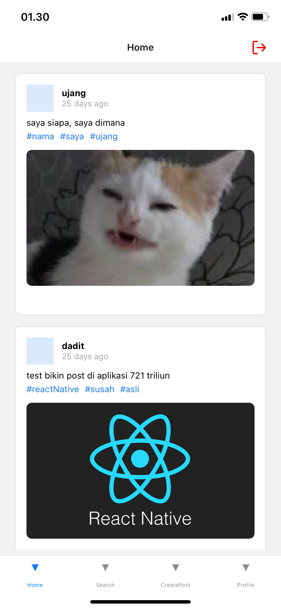

# Line-Mobile

A mobile social media app built with React Native, where you can connect with friends and family, share updates and photos, and see what others are posting.

## Table of Contents

- [Line-Mobile](#line-mobile)
  - [Table of Contents](#table-of-contents)
  - [Introduction](#introduction)
  - [Features](#features)
  - [Tech Stack](#tech-stack)
  - [Installation](#installation)
    - [Prerequisites](#prerequisites)
    - [Prerequisites 2](#prerequisites-2)
    - [Setup Instructions](#setup-instructions)
  - [Screenshots](#screenshots)
    - [Register Screen](#register-screen)
    - [Login Screen](#login-screen)
    - [Home Screen](#home-screen)
    - [Post Detail Screen](#post-detail-screen)
  - [Contact Information](#contact-information)

## Introduction

This social media mobile application is a way to stay in touch, discover new content, and interact with people online.

## Features

- User authentication and authorization.
- CRUD in posting updates.
- Following and Follower functional.

## Tech Stack

- **Frontend:** React Native, Expo, GraphQL, Apollo GraphQL
- **Backend:** GraphQL, Apollo GraphQL, Redis, JWT
- **Database:** MongoDB

## Installation

### Prerequisites

- Node.js
- MongoDB
- Redis
- Expo GO

### Prerequisites 2

Set up your .env file with the following variables:

```env
MONGODB_URI=your_mongoDB_uri
JWT_SECRET=your_JWT_secret
PORT=your_port_number
REDIS_PORT=your_redis_port
REDIS_HOST=your_redis_host
REDIS_PASSWORD=your_redis_password
```

### Setup Instructions

```bash
git clone https://github.com/daditsan/line-mobile
cd line-mobile
npm install
npm start
```

## Screenshots

These are screenshots of the app screens, taken from Iphone 11.

### Register Screen


### Login Screen


### Home Screen



### Post Detail Screen


## Contact Information

For any questions or concerns, reach out to me at <dityaisanda@gmail.com>
Thank you.
